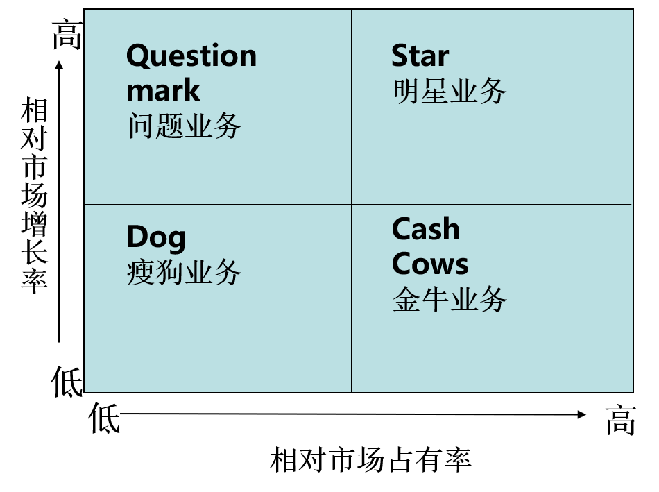

## Thinking1 请思考什么是时序数据库？为什么时间序列数据成为增长最快的数据类型之一?
### 什么是时序数据库?
1. 时序数据库就是以时间为索引的数据库。这一种专门存储和处理带有时间标签或者属性的数据的数据库类型。
2. 相对于关系型数据库，时序数据库具有高效处理海量数据、节省空间、高效的索引的特性。
### 为什么成为增长最快的数据类型?
1. 适应趋势：社会各方面的发展对实时性的需求越来越高，时序数据库的特性能够更高效的满足各行业业务的需求。
2. 产业需求：随着传感器技术技术发展，数据的采集维度颗粒度更小，时间间隔更短，对于能搞高效处理这类型数据成为市场新的需求。
3. 成本优势：由于时间类型数据并没有太多更新和删除操作的特性，利用这个特性能够简化数据库的设计，提高I/O效率，有效降低使用的时间和财务成本。

**参考**：
- https://zhuanlan.zhihu.com/p/57117030
- http://www.d1net.com/bigdata/database/479697.html

## Thinking2 BCG Matrix（波士顿矩阵）四象限分别代表什么？不同象限，有怎样的数据决策

### 波士顿矩阵四象限由相对市场份额和市场增长率两个维度划分成四个。
- 高份额，高增长：明星业务，这类通常是市场新型的业务，需要现金牛的资金去大力发展，是公司下一个增长爆发的希望。
- 高份额，低增长：现金牛业务，这类通常是公司成熟的业务，发展潜力不大，实行保持战略，确保在行业的地位，公司的主要稳定盈利和收入来源。
- 低份额，高增长：问题业务，通常是在新兴业务中自己竞争力不强的业务，需要实行发展战略，需要时时关注市场动向，是一个并不明朗的业务。
- 低份额，低增长：瘦狗业务，实行收割或者放弃的战略，最后能的话就割一波韭菜，然后卖给下一个接盘侠或者直接解散放弃，容易成为公司的累赘。
### 数据决策
- 明星业务持续投入资金发展，让其变为下一个现金牛的业务。
- 现金牛的业务，最终只会向瘦狗业务发展的趋势，需要时刻洞察市场情况并且保持竞争力。
- 问题业务最不明朗，是最终变为为明星业务还是瘦狗业务存在很大的不确定性。尽快投入资金让其变为明星业务。
- 瘦狗业务能变成问题业务的机会不大，不果断放弃容易成为拖垮公司的重要因素。